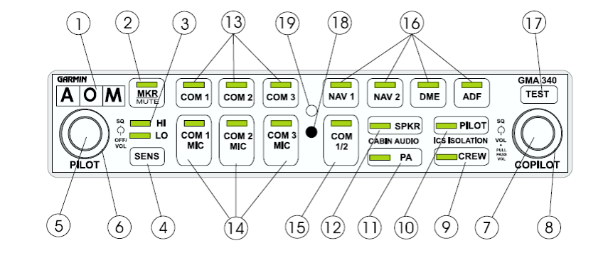

1. Grunddaten Flugzeug: Zelle / Triebwerk:
a) Flügelspannweite _______________________ 1 / _____
b) Wenderadius: _______________________ 1 / _____
c) Bauweise: _______________________
_______________________ 2 / _____
d) Hersteller des Motors: _______________________ 1 / _____
e) Motorbezeichnung: _______________________ 1 / _____
f) Motorbauart: _______________________
_______________________
_______________________ 4 / _____
g) Max. Leistung: ____ PS bei ______ RPM 2 / _____
h) Ölstand min.: _____ qt = ______ l 2 / _____
i) Ölstand max.: _____ qt = ______ l 2 / _____
j) Zulässige Ölsorte
für -1° bis +32°C: _______________________ 1 / _____
k) Propeller: ____ Blatt, _______ Steigung 2 / _____
l) max. Lastvielfaches: _____ g _____ g Klappen __________
_____ g Klappen __________ 5 / _____
m) Fahrwerk: _______________________ 2 / _____

2. Gewichte / Massen:
a) Max. Rollgewicht: _____________ kg 1 / _____
b) Max. Startgewicht: _____________ kg 1 / _____
c) Max. Landegewicht: _____________ kg 1 / _____
d) Max. Zuladung im Gepäckraum: _______ kg Zone 1
_______ kg Zone 2
_______ kg Gesamt 3 / _____
e) Leergewicht D-EDGG: _____________ kg 1 / _____
f) Leergewichtsmoment D-EDGG ___________m*kg 1 / _____
3. Kraftstoff / Kraftstoffsystem:
a) Zulässige Kraftstoffsorten _______,__________,____________ 3 / ______
b) Gesamtfassungsvermögen: ________ l = _______ USG (beide Tanks) 2 / ______
c) Ausfliegbarer Kraftstoff: _________ l = _______ USG (beide Tanks) 2 / ______
d) Farbe von AVGAS: _____________ 1 / ______
e) Dichte/Spezifisches Gewicht MOGAS: ___________ kg/L 1 / ______
f) Wie viele Drain-Stellen hat die C152? __________________ 1 / _____
(Angabe gemäß Handbuch / Erfahrung am echten Flugzeug)
g) Wo befinden sich diese: _______________________________
_______________________________
_______________________________ 4 / _____
h) Wie gelangt der Kraftstoff aus den Tanks zum Vergaser?
_______________________________________________________ 1 / ____

4. Geschwindigkeiten / Grenzen / Fahrtmessermarkierungen
Bezeichnung KIAS Konfiguration
VNE ____  3 / _____
vNO _____ 3 / _____
vA               758 kg
vA               680 kg 3 / _____
VFE              10°
VFE              20°
VFE              30° 2 / _____
Höchstzulässige Geschwindigkeit bei geöffnetem Fenster 1 / _____
vSO _____               ° Klappen, max. Gewicht, vordere Schwerpunktlage 3 / _____
vS _____                ° Klappen, max. Gewicht, vordere Schwerpunktlage 3 / _____
vX ____           758 kg 2 / _____
vY ____               758 kg, MSL  2 / _____
Normaler Reisesteigflug   ____      ____ ° Klappen 3 / _____
VG Beste Gleitfluggeschwindigkeit ____   ____ ° Klappen 2 / _____

Fahrtmesser - Markierungen:
Markierung  KIAS - Bereich   Bedeutung
Weißer Bogen                             3 / ____
Grüner Bogen                             3 / ____
Gelber Bogen                             3 / ____

5. Technik:
a) Wie viele Abnahmestellen für den statischen Druck (Static Port) hat eine C152? _____________ 1 / _____
b) Wo befinden / befindet sich diese: ________________________ 1 / _____
c) Welche Instrumente wären von einer Blockade des Static Ports betroffen?  ________________________________________________________ 3 / _____
d) Wie oft betätigt man den Primer (Einspritzpumpe) (> 0°C)? _____ 1 / _____
e) Wie schnell muss sich der Öldruck (abhängig von der Jahreszeit) aufbauen? _____________________________________ 2 / _____
f) Was ist der Mindestöldruck nach dem Anlassen? _____________ 1 / _____
g) Wie ist der Mindestöldruck auf dem Instrument gekennzeichnet? _______________________________________________________ 1 / _____
h) Beschreiben Sie in Grundzügen das Anlassverfahren eines warmen Triebwerks:
Gemisch ______________________
Vergaservorwärmung ______________________
Anlasseinspritzung („Primer“) ______________________
Gashebel ______________________
4 / _____
i) Wie können Sie überprüfen ob nach dem Anlassen der Anlasser auch ausgeschaltet / ausgekoppelt ist?
_______________________________________________________ 1 / _____
j) Bei welcher Drehzahl werden die Zündmagnete geprüft? _______ 1 / _____
k) Wie viele Zündmagnete hat eine C152? _________ 1 / _____
l) Welcher Drehzahlabfall ist erlaubt? ________________________ 2 / _____

m) Was ist der erlaubte Drehzahlabfall beim Prüfen der
Vergaservorwärmung?
________________________________ 1 / _____
n) Welche Klappenstellungen sind für den Start erlaubt? ____°, ____° 2 / _____
o) Welche Spannung hat das Bordnetz einer C152? ______________ 2 / _____
p) Wie wird der Alternator angetrieben? ___________________ 1 / _____
q) Wie werden die Landeklappen betrieben? __________________ 1 / _____
r) Bei Ausfall des elektrischen Systems fällt der Motor aus.
Diese Aussage ist _________________________________ 1 / _____
s) Welche Instrumente werden über Unterdruck (Suction) angetrieben?
__________________________________________________ 2 / _____
t) Wie kann, während des Fluges, die Verlässlichkeit der Kreisinstrumente
bzw. deren Funktion überwacht werden?
__________________________________________________
__________________________________________________ 2 / _____
u) Wie wird die Heizungsluft erwärmt? ________________________
__________________________________________________ 1 / _____
v) Welche Gefahr kann dadurch entstehen? ____________________ 1 / _____
w) Dürfen mit ausgefahrenen Klappen SLIPS geflogen werden?  ____________________ 1 / _____

6. Avionik
a) Darf beim Anlassen/Abstellen des Triebwerks die Avionik eingeschaltet sein?
 JA
 NEIN
1 / _____
b) Warum? _______________________________________________________________
_______________________________________________________________ 1 / _____
c) Über welchen Drehregler auf dem Intercom (GMA340) lässt sich die
Lautstärke der Bordverständigung (Intercom) für den Piloten (Flugschüler) anpassen?
Drehregler Nr: _______________________ 1 / _____

e) GNS430: In welcher Seitengruppe (PAGE GROUP) finden Sie Informationen zu den
nächstgelegenen Flughäfen?
__________________________________________________________ 1 / _____
h) GNS430: Was wird Ihnen auf der ersten Seite (nach dem Einschalten) des GNS430
angezeigt?
__________________________________________________________ 1 / _____
i) GTX330 Transponder: Mit welchen Tasten kann der Transponder angeschaltet werden?
__________________________________________________________ 3 / _____
j) GTX330 Transponder: Was bewirkt das drücken der „VFR“ Taste?
__________________________________________________________ 2 / _____